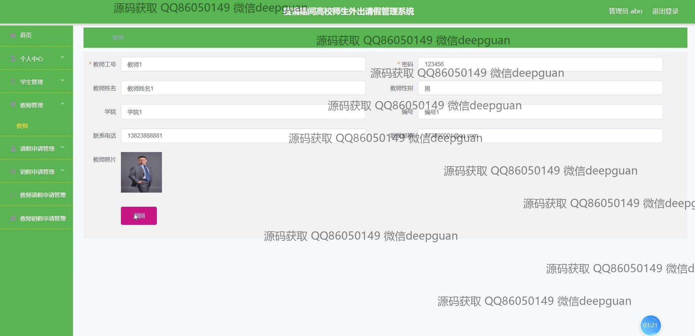

<h1 align="center">疫情期间高校师生外出请假管理系统+vue</h1>

## 简介
疫情期间高校师生外出请假管理系统：支持角色管理包括管理员、学生和教师；功能涵盖注册登录、个人信息修改、请假申请及管理、审核操作和密码更改。    --计算机毕业设计源码；毕设源码；java毕业设计源码

## 联系方式

<h3 align="center">获取完整代码与数据库文件 + 微信：deepguan QQ: 86050149 QQ群: 783742310</h3>

<h3 align="center">可帮忙远程部署 包运行成功！提供远程部署、修改代码、设计文档指导、代码讲解等服务！</h3>

## 功能介绍（完整见运行截图）

## 运行截图

本代码来源于网络,仅供学习参考使用!

